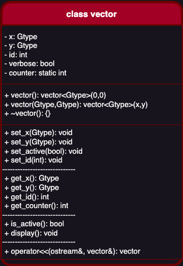

### ___The UML Diagram___
---
In our project there is many class, one of them is ___vector class___ which is the base class of ___vector2d class___. We will use the ___draw.io___ to make our class diagram alive and modren.

#### Vector Class Diagram:
_In figure below the UML of vector class:_



```lua
+-----------------------------------------+
|                vector                   |
+-----------------------------------------+
| - x : double                            |
| - y : double                            |
| - id: int                               |
| - verbose: bool                         |
+-----------------------------------------+
| + vector() : vector<Gtype>              |
| + vector(Gtype,Gtype) : vector<Gtype>   |
| + ~vector() :                           |
+-----------------------------------------+
| + set_x(Gtype) : void                   |
| + set_y(Gtype) : void                   |
| + set_active(bool) : void               |
| + set_id(int) : void                    |
|--------------------------               |
| + get_x() : Gtype                       |
| + get_y() : Gtype                       |
| + get_id(): int                         |
|--------------------------               |
| + is_active() : bool                    |
| + display() : void                      |
|--------------------------               |
| + operator<<(ostream&,vector&) : vector |
+-----------------------------------------+
```
