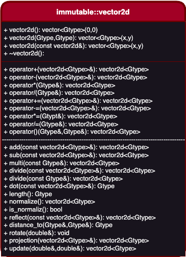

### ___The UML Diagram___
---
In our project there is many class, one of them is ___vector2d class___ which is the class contain ___basic vector math algebra___. We will use the ___draw.io___ to make our class diagram alive and modren.

#### Vector2d Class Diagram:
_In figure below the UML of vector2d class:_

